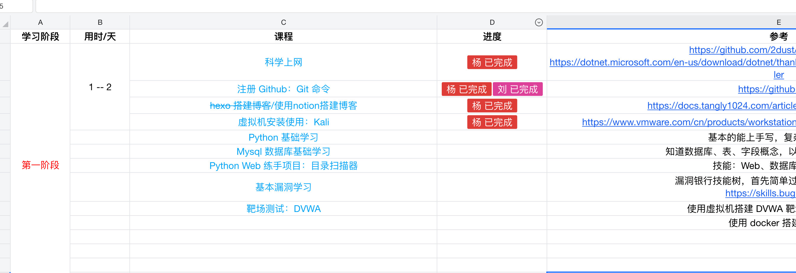

# 如果当年有人这样带我学网络安全，可能会少走很多弯路

> SecMentor 项目地址： https://github.com/yhy0/SecMentor

去年，我跟我弟说过一句话。

如果以后不知道学什么，可以试试网络安全。

当时他还要准备考试，我也没有继续追问。这种事情催得太早没有什么用，考试没结束，心思也很难放在别的地方。

后来大家各忙各的，这件事就放下了。

最近他开始放暑假，时间一下子多了起来。我又想起了之前的话，觉得还是应该督促一下。放假玩游戏、刷视频都很正常，我以前也一样，但如果整个暑假全部这样过去，多少有点可惜。

每天不用学很多，能认真学一点就行。

能坚持一个月、两个月，还是几天以后就不想学了，我也不知道。以后会不会进入网络安全行业，现在想这些也太早。

我只是觉得，学习很少会完全浪费。

以前网上经常有人写：

> 1 的 365 次方还是 1
> 
> 1.01 的 365 次方，大约是 37.8

这个计算经常被当成鸡汤，我倒没有觉得它能说明多少人生道理。但每天多做一点，时间长了确实会留下东西。

我自己就是这样过来的。

## 当时没有人告诉我该学什么

我是家里第一个大学生。

家里没有人做互联网，也没有人了解计算机专业。刚上大学的时候，没人能告诉我以后应该学什么，哪些方向适合我，毕业以后该做什么工作。

我自己也不知道。

比较幸运的是，学校里有一个网络安全社区。

那时候“黑客”这个词，对一个刚上大学的我还是很有吸引力的。感觉很神秘，也很酷，好像学会以后就能看到计算机世界的另一面。

所以我就一头扎了进去。

跟着社区里的学长折腾 Linux，搭环境，看论坛，找教程，打一些简单的靶场。有时候为了装一个工具折腾一晚上，第二天回头看，工具到底是干什么的都不一定说得清楚。

现在再回想那段时间，好像也没有系统学到多少东西。

没有清晰的路线，也没有人每天检查进度。今天看一点 Web，明天碰一下逆向，过几天又去研究别的。很多概念当时只是听过，很多实验也只是跟着别人做出来了。

但我一直没有彻底放下。

中间会偷懒，也会很长时间没有进展，最后还是留在了这个方向。毕业的时候，我没有去做开发，继续选择了网络安全。

后来工作了几年，再回头看大学里的那段经历，很多细节已经记不清了。当时装过什么工具、打过哪些靶场，也没有想象中那么重要。

真正留下来的，是遇到问题以后愿意继续查下去。

一个服务为什么访问不了，一段代码为什么没有按照预期运行，一条请求到底经过了哪些处理。先猜一个原因，再找日志、看代码、改参数，发现猜错了就重新来。

安全工作里很多事情都是这样。

有时研究很久也没有结果，但至少知道前面的路走不通了。下一次遇到相似的问题，会比上一次多一个判断。

所以，即使这几年圈里经常有人说网络安全已经成了“讨饭行业”，我还是愿意让我弟试一试。

行业确实没有以前那么轻松，岗位会卷，收入也未必符合预期。站在已经工作很多年的人的角度，这些吐槽都很正常。

但对一个还没有毕业、也没有多少资源的普通学生来说，计算机仍然是少数可以靠自己反复练习、慢慢积累的方向。

代码能不能运行，漏洞能不能复现，报告有没有价值，分析能不能经得起验证，很多结果比较直接。

安全能力也不只对应一份固定岗位。在合法授权范围内，SRC、漏洞赏金、护网等项目，也提供了其他实践和收入路径。

当然，只会安装几个工具、复制几条命令，很难靠这些事情获得什么。它也绝对不是一条轻松的路。

但至少可以学，可以练，也可以看到自己的进步。

## 以前没有人带，现在有了 AI

去年第一次跟我弟提到网络安全时，我其实也想过应该怎么教。

我可以给他列一条路线。

先学一点 Linux，再补网络和 HTTP，然后接触 Web 开发、常见漏洞和靶场。哪些工具不用太早装，哪些知识应该先理解，我大概有自己的判断。

列出来不难。

难的是每天怎么学。

今天应该做什么，昨天的内容到底有没有理解，命令运行成功是因为会了，还是照着复制了一遍。实验失败以后，是概念没懂，还是环境没有配置好。

这些事情如果没人跟着，很容易混在一起。

新人看到一个报错，可能会认为自己什么都不会；跟着教程跑通一条 Payload，又可能觉得这个漏洞已经学会了。

我没有时间每天坐在旁边教他。

发一套课程过去也可以，但我对结果没有太大信心。大概率是刚开始看几天，收藏很多资料，安装几个工具，后面慢慢就没有下文了。

这两年，AI 已经进入了我的日常工作。

我会用它读代码、分析日志、写检测规则、整理数据，也会拿一些没想清楚的产品和架构问题跟它讨论。

它经常犯错。

有时候漏掉明显的信息，有时候把猜测说得非常确定，还有时候顺着我的话一直往下编。所以涉及结论的部分，我还是会回到代码、数据和原始资料里确认。

不过它确实有一些地方很适合学习。

一个概念没听懂，可以换一种说法再讲。环境报错了，可以把终端输出给它，一步一步排查。看到陌生代码，可以先让它拆开，再顺着调用链自己验证。

我后来想了一下，如果现在让我重新从大一开始学网络安全，我应该不会再为了一个环境问题，在论坛里翻一晚上帖子。

我会先问 AI。

它给出的答案可能不对，但至少可以帮我快速列出几个排查方向。我再根据实际输出，一个一个验证。

既然我自己已经这样工作了，或许也可以让它陪一个新人学习。

## 第一版很快就跑起来了

上周末，我把这个想法交给 Cursor，让它先做一个能运行的版本。

从提出想法，到仓库里出现第一套可以实际使用的 Skills，并没有花多长时间。现在用 AI 做这种项目，写代码反而不是最慢的部分。更麻烦的是，你到底希望 Agent 怎么做，以及它实际执行时会不会跑偏。

第一版的问题不少。

有时讲得太多，有时答案给得太快。有时学习者只说了一句“懂了”，它就真的继续往下走。进度怎么记录、难度怎么调整、一次实验做到什么程度才算掌握，现在也只是先定了一套规则。

我没有教学经验，这些设计更多来自自己以前学习时踩过的坑。放到一个真正的新人身上会怎么样，现在还说不好。

项目已经开源，想体验的可以直接打开仓库，让 Agent 按照里面的流程带着学习：

> **SecMentor 项目地址：**
> https://github.com/yhy0/SecMentor

可以告诉它自己会什么、每天有多少时间、想从哪个方向开始，也可以什么都不准备，先让它做一次摸底。

WorkBuddy 小程序已经可以在手机上发起和继续任务，也能使用 Skills。后面我准备试试，SecMentor 能不能把其中一部分学习放到手机上，比如查看当天目标、继续追问和完成复盘。

项目里已经记录了学习进度、积分和实验情况。如果实际使用下来确实有需要，还可以补一个简单的进度和成就页面，看看今天学了什么、连续学了多久、完成过哪些实验，以及下一步可以做什么。

这些暂时都只是后面的想法。对这个方向感兴趣，也欢迎提交 Issue 或 PR。

接下来先让我弟用。

他卡在哪里，我就看哪里。Agent 哪次犯傻了，再接着改。

去年我只是跟他说，可以试试学网络安全。

今年暑假，我先把这套 Skills 做出来了。

到底有没有用，先让他试一段时间再说。

## 每天怎么学（给学员）

- 开始：每天第一条消息发 `/sec-mentor-core`（继续上一课用 `/sec-mentor-stages`）。确保 Agent 完整加载 Skills，不会「裸跑」变敷衍、不提问。  
- 结束：让它做一次当日小结（写进 journal 和进度），下次开新对话它才记得今天学了什么、卡在哪。
